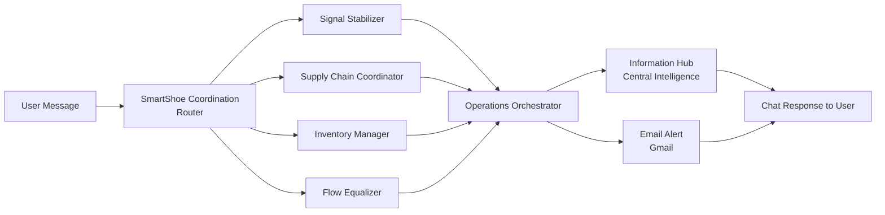

# SmartShoe Operations Agent — Multi-Agent AI for Supply Chain Coordination

A generative multi-agent AI system, built on [StackAI](https://www.stackai.com/), that gives **SmartShoe** — a synthetic retail/footwear company used as the business case — a single conversational interface to its supply chain, inventory, and operations data. Instead of stakeholders chasing down five different systems or teams to answer one operational question, they ask a chatbot.

**Try it live:** [SmartShoe Operations Chatbot](https://www.stackai.com/chat/69151ac5bef1a6ee72a6aba6-41ptbJ3YNgVYWhJ4NR0toG)

## The Business Problem

Retail and footwear operations depend on coordination across four functions that rarely talk to each other in real time: demand forecasting, supplier management, inventory allocation, and production/distribution flow. In most mid-size retail organizations, this coordination happens manually — through spreadsheets, email threads, and whoever happens to answer a Slack message first. That creates concrete, costly problems:

- **Slow reaction to disruptions.** When a supplier pushes back a shipment or a demand forecast shifts, someone has to notice it, figure out who else it affects (inventory? production flow? other suppliers?), and manually loop them in. That lag translates directly into stockouts, excess inventory, or missed sales windows.
- **Fragmented, inconsistent answers.** Ask the inventory team and the supply chain team the same operational question and you may get two different answers, because each is working from its own view of the data with no shared source of truth.
- **No accessible entry point for non-technical stakeholders.** A store manager or business analyst who wants to know "what does this forecast change mean for us?" has no way to ask that directly — they have to know which spreadsheet to open or which specialist to email, and then wait.
- **Reactive instead of proactive operations.** Without a system watching for cross-functional impact, issues typically surface only after they've already caused a problem (a stockout, a missed shipment) rather than being flagged the moment the triggering event occurs.

The business cost of this isn't abstract: it shows up as lost sales from stockouts, working capital tied up in excess inventory, and slower decision cycles that compound during periods of volatility (holiday demand spikes, supplier disruptions, etc.).

**This project prototypes a different operating model:** instead of routing questions to people, route them to a coordinated team of AI agents — each grounded in the real data of one operational domain — that can answer instantly, reason across domains when needed, and proactively escalate what matters. It replaces "who do I ask?" with "just ask."

## How It Works

A user message (e.g. *"Our main supplier just pushed back a shipment by two weeks — what's the impact?"*) is picked up by a routing agent, fanned out to whichever specialist agents are relevant, synthesized into one coherent answer, and returned as a chat response (and, where warranted, an email alert to stakeholders).

### The Agents

Each specialist agent runs on GPT-5, is grounded in its own synthetic knowledge base (an Excel workbook of realistic company data), and hands off to a peer agent when a question falls outside its domain.

| Agent | Role | Knowledge Base |
|---|---|---|
| **SmartShoe Coordination Router** | Entry point — classifies the incoming inquiry (forecast change, supplier update, stock movement, etc.) and routes it to the right specialist(s) | — |
| **Signal Stabilizer** | Smooths and interprets noisy demand signals so downstream agents act on stable, trustworthy forecasts | `SignalStablizer.xlsx` |
| **Supply Chain Coordinator** | Tracks supplier lead times, purchase orders, and delivery risk | `SupplierCoordinator.xlsx` |
| **Inventory Manager** | Monitors stock levels and replenishment needs across locations | `InventoryBalancer.xlsx` |
| **Flow Equalizer** | Balances production and distribution flow so no node in the chain is over- or under-loaded | `FlowEqualizer.xlsx` |
| **Operations Orchestrator** | Synthesizes the specialist agents' outputs into a single, coherent operational recommendation | `OperationsOrchestrator.xlsx` |
| **Information Hub** | Formats the orchestrated result into the final response the user sees in chat | — |
| **Email Alert (Gmail)** | Pushes the orchestrator's finding to stakeholders by email when a response warrants proactive escalation | — |

## Why Multi-Agent Instead of One Prompt

A single general-purpose prompt would have to hold supply chain, inventory, forecasting, and production knowledge simultaneously, making it harder to keep accurate and harder to extend. Splitting expertise across agents means:

- Each agent's knowledge base and instructions stay focused and easier to validate.
- Specialists can be updated independently as the underlying data changes, without touching the others.
- The Operations Orchestrator produces one unified answer even when a question spans multiple domains (e.g., a supplier delay that also affects inventory and flow).

## Business Impact

- **Faster operational response** — a question that used to require pinging multiple teams gets a synthesized answer immediately.
- **Consistent decision-making** — every stakeholder queries the same grounded knowledge base instead of relying on whoever happens to be available.
- **Proactive alerting** — the system can escalate significant findings by email rather than waiting for someone to ask.
- **Extensible foundation** — new operational domains can be added as additional specialist agents without redesigning the whole system.

## Repository Contents

| File | Description |
|---|---|
| `SignalStablizer.xlsx` | Synthetic demand-signal data for the Signal Stabilizer agent |
| `SupplierCoordinator.xlsx` | Synthetic supplier/purchase-order data for the Supply Chain Coordinator agent |
| `InventoryBalancer.xlsx` | Synthetic stock-level data for the Inventory Manager agent |
| `FlowEqualizer.xlsx` | Synthetic production/distribution flow data for the Flow Equalizer agent |
| `OperationsOrchestrator.xlsx` | Synthetic cross-domain data used by the orchestrator to reconcile specialist outputs |

All data is synthetic, generated to resemble realistic company records for prototyping purposes — no real company or customer data is used.

## Tech Stack

- **[StackAI](https://www.stackai.com/)** — visual multi-agent orchestration platform
- **GPT-5** — reasoning engine for each agent
- **Gmail integration** — for automated stakeholder alerts
- **Excel (.xlsx)** — synthetic knowledge base storage per agent
